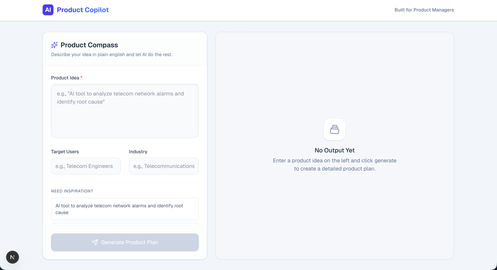

# AI Product Copilot

[](https://your-demo-url.vercel.app)
[](https://nextjs.org)
[](https://www.typescriptlang.org)
[](https://tailwindcss.com)

> Turn any product idea into a complete PRD, MVP scope, success metrics and roadmap in seconds.

---

## Screenshot



---

## What It Does

AI Product Copilot takes a raw product idea — just a few words or sentences — and instantly generates a structured, professional product document. Powered by Google Gemini, it thinks like a senior PM and produces five key output sections:

| Section | Description |
|---|---|
| **Problem Definition** | Articulates the core user problem, who faces it, and why it matters — the foundation of any good product |
| **Product Requirements** | Detailed functional and non-functional requirements grounded in user needs |
| **MVP Scope** | A focused, ship-it-now scope that balances speed with value — what's in, what's out, and why |
| **Success Metrics** | Quantifiable KPIs and OKRs to measure whether the product is actually working |
| **Product Roadmap** | A phased rollout plan from MVP launch through growth, with milestones and priorities |

---

## Built With

- **[Next.js 15](https://nextjs.org)** — React framework with App Router and API routes
- **[TypeScript](https://www.typescriptlang.org)** — Type-safe development throughout
- **[Tailwind CSS](https://tailwindcss.com)** — Utility-first styling with a purple/indigo design system
- **[Google Gemini API](https://ai.google.dev)** — Large language model powering the AI generation (`gemini-2.5-flash`)
- **AI-assisted development** — Built with Claude Code (Anthropic) for accelerated, high-quality output

---

## Key Features

- **Export to DOC** — Download your generated PRD as a Word document, ready to share with your team
- **Inspiration Examples** — Not sure what to build? One-click example prompts to get you started across different industries
- **Industry & Target User Context** — Optionally specify your industry vertical and target user persona to get more tailored, relevant output
- **Instant Generation** — Full structured PRD in seconds, not hours
- **Clean, Readable Output** — Formatted sections with clear hierarchy, easy to scan and present

---

## About the PM

Built by **Prerna Singh**, Product Manager.

This tool was born from a real frustration: early-stage product thinking is hard to structure, and the blank page is the enemy of momentum. AI Product Copilot is designed to get PMs, founders, and builders unstuck — fast.

[](https://linkedin.com/in/prernasingh925)

---

## Run Locally

**Prerequisites:** Node.js 18+ and a [Google Gemini API key](https://aistudio.google.com/app/apikey)

```bash
# Clone the repo
git clone https://github.com/your-username/ai-product-copilot.git
cd ai-product-copilot

# Install dependencies
npm install

# Add your Gemini API key
echo "GEMINI_API_KEY=your_api_key_here" > .env.local

# Start the development server
npm run dev
```

Open [http://localhost:3000](http://localhost:3000) in your browser.

---

<p align="center">
  Made with intention by a PM who wanted a better way to think through product ideas.
</p>
